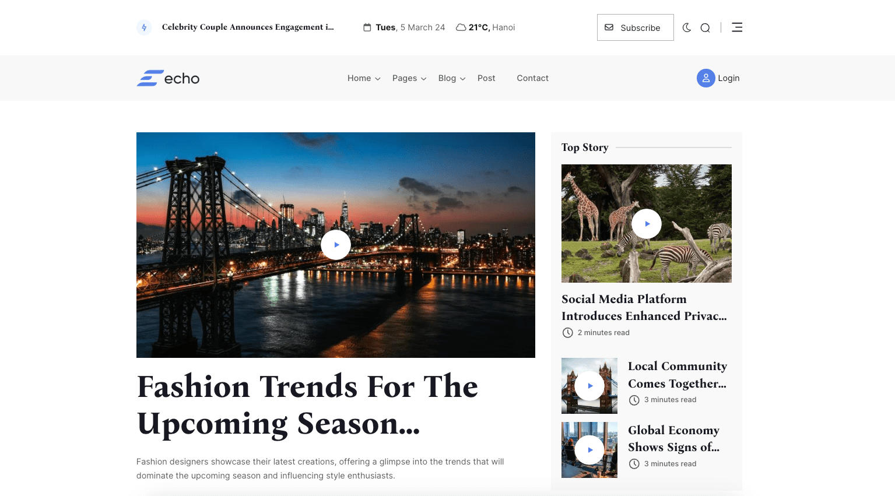

# Echo - Laravel News & Magazine

## Introduction

Echo is a multipurpose Laravel News & Magazine. This script comes with 10 high-quality pre-build home pages and many
built-in awesome features.

It is built on top of Botble CMS, which is a Laravel-based CMS. It offers remarkable flexibility for various use cases.

Released Date: **March 01, 2024**

Author: **[Archi Elite](https://archielite.com)**

Email: **contact@archielite.com**

Thank you for purchasing our product. If you have any questions that are beyond the scope of this help file, please feel
free to email via our user page contact form [here](https://codecanyon.net/user/archielite) for quick support. Thank you
so much!

## Features Overview

* Buy One Time & Get Free Updates Forever 
* **Free Theme Installation** – If you will face any problem during installation – we will help you and It’s FREE
* Bootstrap 5.x Framework: Bootstrap is the most popular HTML, CSS, and JS framework for developing responsive,
  mobile-first projects on the web.
* Based on our Botble CMS (using modern Laravel framework) which is used by thousands of customers.
* Full Blog features.
* 10 different homepages to give you the best selections in customization.
* Touch Friendly: Easy browsing on touch devices.
* 100% Fully Responsive: Whatever you are using the device your site will run as it should be.
* Powerful admin panel, all things can be changed from the admin panel, no hardcode.
* Nice and clean design from our designer expert.
* Easy to install with UI - [How to install a script based on Botble CMS](https://www.youtube.com/watch?v=Ox2WgQqOQoQ).
* Multi-language: unlimited language support.
* Google Analytics: display analytics data in the admin panel.
* Translation tool: easy to translate the front theme and admin panel to your language.
* Right To Left (RTL) language support.
* Fast support: we always reply to your ticket within 1 business day.

## Demo

* Homepage: https://echo.archielite.com
* Admin panel: https://echo.archielite.com/admin
* Admin account: `admin` – `12345678` (username & password are autofilled)
* Account login URL: https://echo.archielite.com/login
* Account credential: `member@archielite.com` – `12345678`

## Archi Elite Team

For more about our team, visit us at https://archielite.com.
