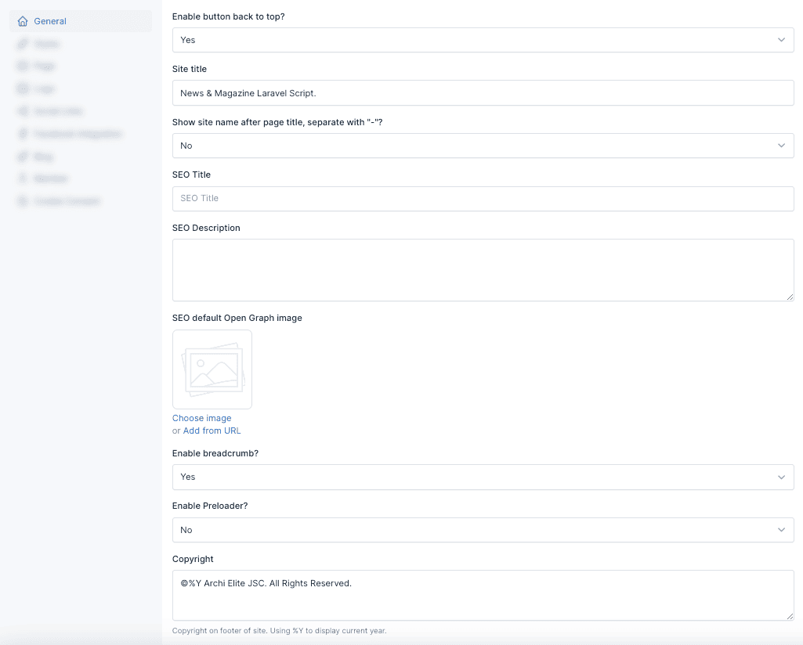
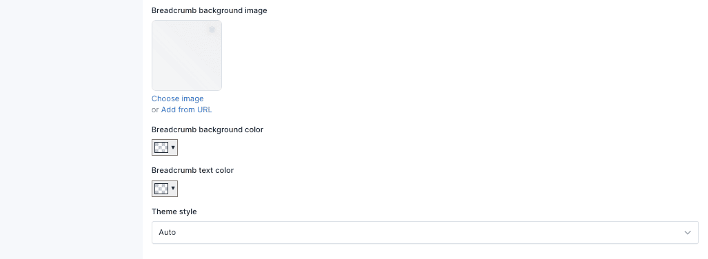
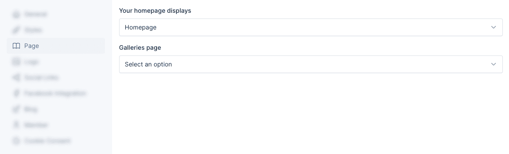
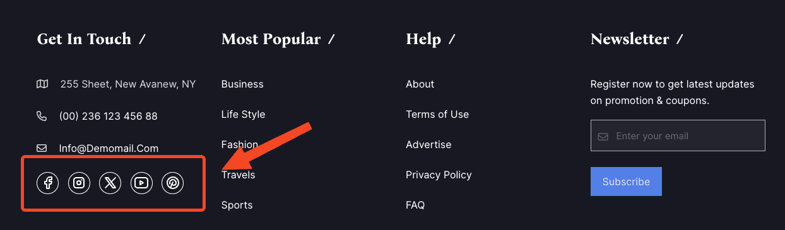
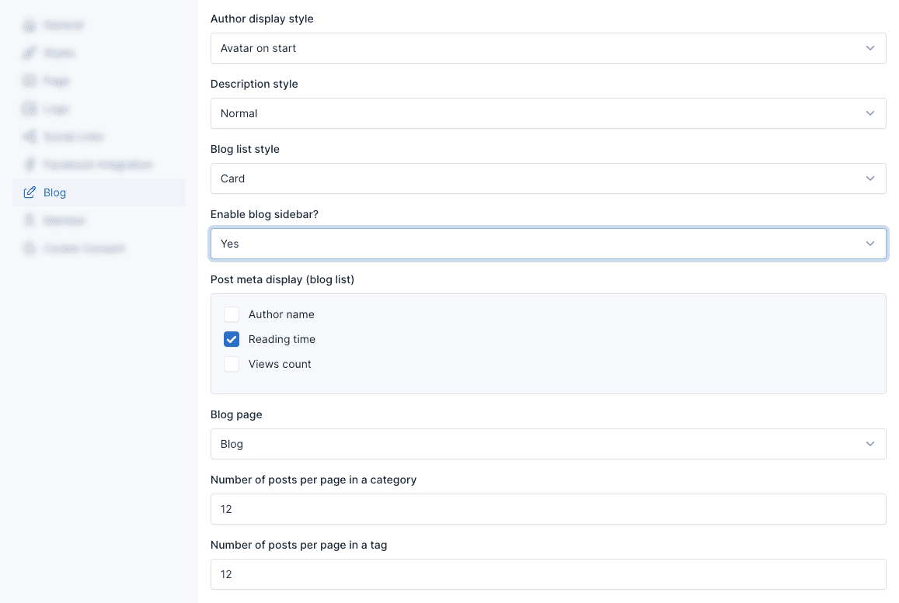
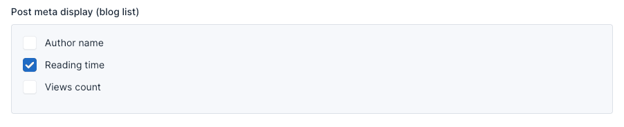
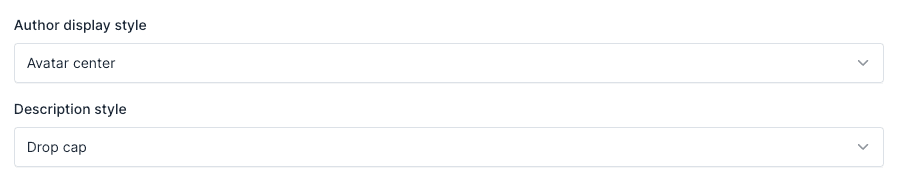
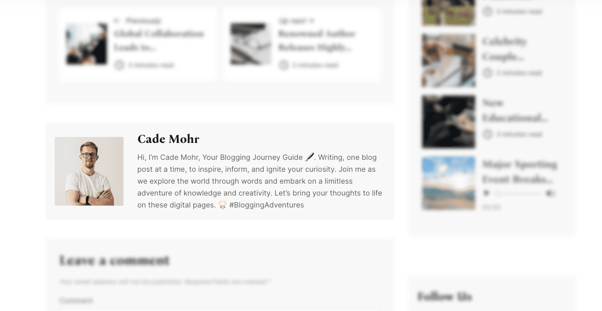

# Theme Options

Theme options are a great way to customize your theme. You can change the color, typography, layout, and more.

To access the theme options, go to `Appearance` -> `Theme Options` in your admin panel.

## General

The **General** tab allows you to configure fundamental settings that shape your website's identity and basic operation.

This section typically includes options for setting your site name, description, and other essential details.

### Preloader 

The preloader is a small animation that appears while your website is loading. You can enable or disable it in the *General* tab.

## Style

The **Styles** tab within the theme options empowers you to personalize the visual identity of your website.

### Breadcrumb

Style breadcrumb at here apply all page has breadcrumb, except for custom pages with their own breadcrumb style.

### Theme style

Setup dark/light mode. When selecting `auto`, it will follow the device settings.

Frontend

## Page

You can specify pages to use as homepage and galleries page at here.

## Social Links

Social links are a great way to connect with your audience. You can add your social media links in the **Social Links**
tab.

Then, these links can be used in **[Site Information](./usage-widgets.md#4-footer-primary-sidebar)** widget and 
**[Social Links](./usage-widgets.md#4-footer-primary-sidebar)** widget.

**Site Information Widget** in the **Footer Sidebar**:

**Social Links Widget** in the **Menu Sidebar**:

## Blog

In here, there are various options to configure your website that related to Blog features. You can set the number of
posts, categories, tags per page, display style or even post item display style, and more.

### Blog sidebar

If enabled, blog sidebars will display on the blog list page.

### Post meta display

This options only apply to blog list.

Demo:

### Post details style

You can custom style your post detail using options:

#### Author display style

Options: `Avatar on start`, `Avatar on center`

Avatar on start:

Avatar on center:

#### Description style

Options: `Normal`, `Drop cap`

Drop cap: 

