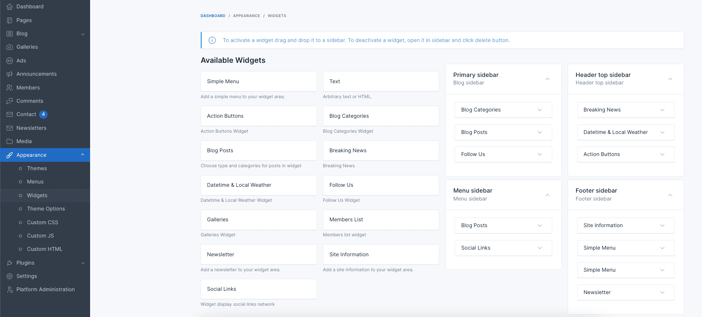
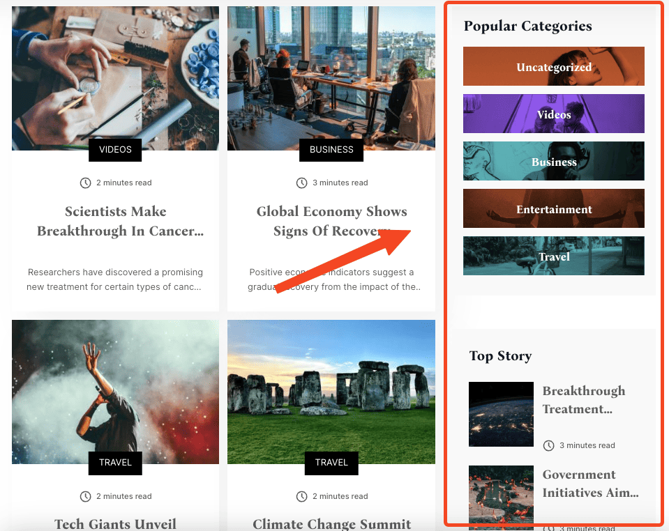
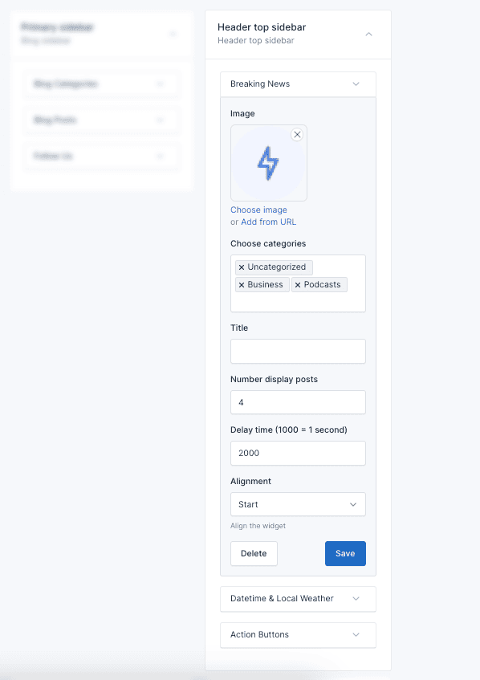
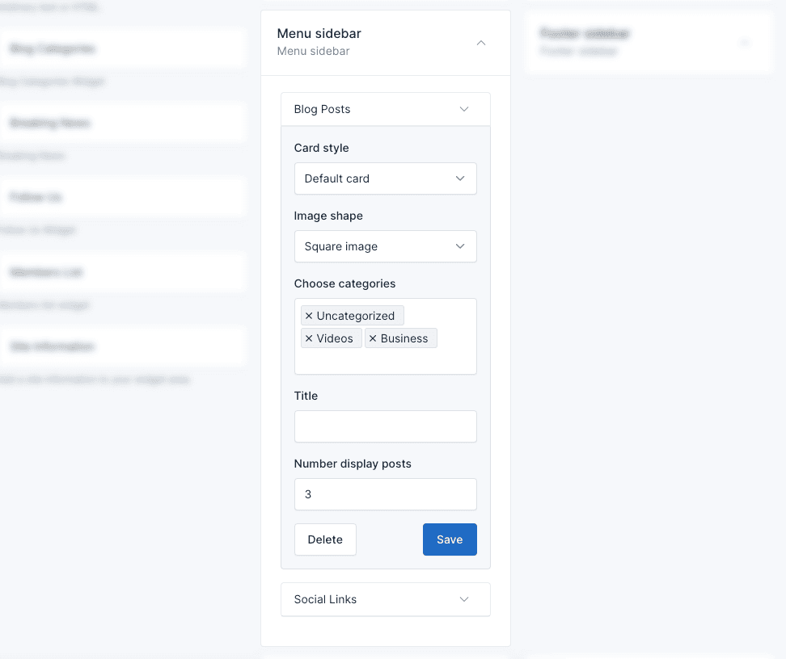
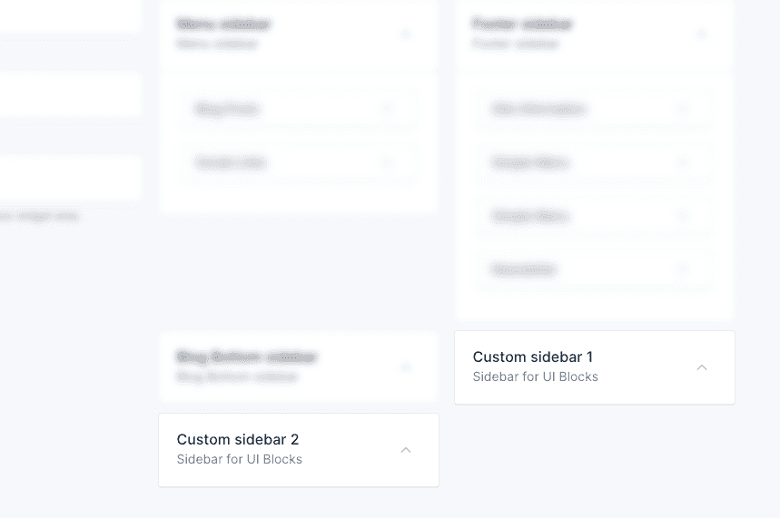

# Widgets

Echo provides five pre-made widget areas to help you customize the user interface and organize content strategically.

These sidebars offer flexibility in placement and functionality, allowing you to tailor the user experience on different
sections of your online store.

## Manage Widgets

To manage the widgets, go to the `Appearance` -> `Widgets` menu in the admin panel.

To add a widget to a sidebar, drag and drop the widget from the left side to the sidebar area on the right side.

## Widget Areas

### 1. Primary sidebar

It appears on the right side of the blog list page. You can use this area to display related posts, categories,
follows us, below is an example of using **Blog categories**, **Blog posts**, **Follow Us** widgets.

### 2. Header top sidebar

Header top sidebar is the sidebar that appears on the top side of the all page. You can use this area to display widgets
such as **Breaking News**, **Datetime & Local Weather**, **Action Buttons**.

### 3. Menu sidebar

Located at the sidebar menu. It's perfect for displaying recent . You can use this area to display widgets
such as **Blog Posts**, **Social Links**.

### 4. Footer sidebar

Occupying the central and often most prominent position in the footer, this sidebar is well-suited for showcasing
essential information like site information, menus, and contact details.

In the example below, we use:

* **Site Information** widget to display details about the site, logo, and social media.
* **Simple Menu** widget to display a custom menu.
* **Newsletter form** widget to display contact details.

::: tip
To use the **Newsletter** widget, you need to activate the **Newsletter** plugin in `Plugins` -> `Installed Plugins`.
:::

### 5. Custom sidebar

This sidebar used 

These sidebars are used to display in the shortcode **Blog posts** and **Blog categories**.

## Delete Widgets

If you don't want to use the widgets in some areas, you can remove them by collapsing the widget and clicking the
**Delete** button.

